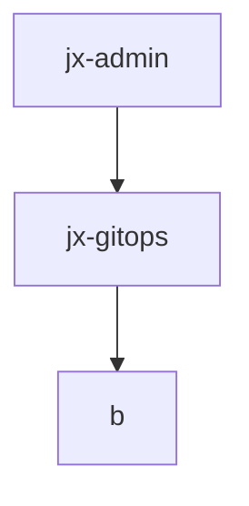

# Jenkins X Bootjob

## Control Flow



## Understanding the bootjob logs

```
tailing boot Job pod <pod-name>
```

this is the output from **viewJobLog function** from ***jx-admin/pkg/cmd/joblog***.
this runs `make apply`
to be read...

```
jx gitops git setup
```
Now according to logs this command runs next, **but how??**

This command :
- checks for `XDG_CONFIG_HOME` variable in $HOME dir.
- reads the `jx-requirement.yml` from cluster-repo.
- take github-credentials *username and password*


