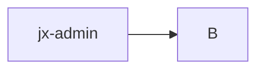

# Jenkins X Bootjob

## Control Flow



## Understanding the bootjob logs

```bash
tailing boot Job pod <pod-name>
```

this is the output from **viewJobLog function** from ***jx-admin/pkg/cmd/joblog***.


